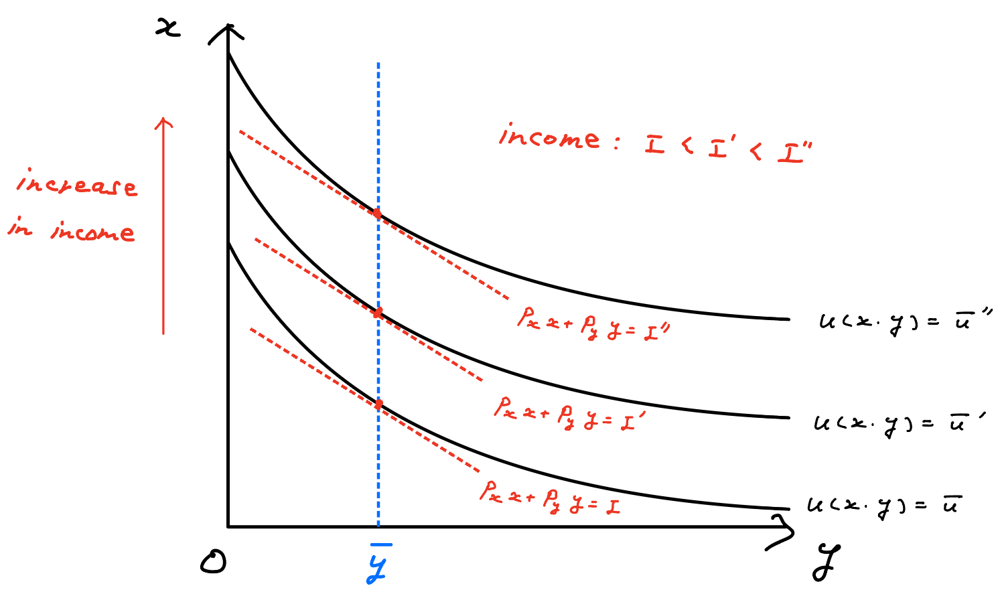

class: middle

```{r, child = '../setup.rmd', cache = FALSE}
```

```{r xaringan-scribble, echo=FALSE}
xaringanExtra::use_scribble()
```

```{r, include = F, cache = FALSE}
library(data.table)
library(ggplot2)
library(dplyr)
library(gganimate)
library(gifski)
library(gganimate)
# library(learnr)
```

```{r, include = F, eval=F, cache = FALSE}
httpgd::hgd()
httpgd::hgd_browse()
```

```{r xaringan-tachyons, echo=FALSE}
xaringanExtra::use_tachyons()
```


<!-- .content-box-green[**A Useful tip:**]

hitting letter "o" key will give you a panel view of the slides -->

<!-- ---
class: middle -->

+ Jay's office hours
  + Tuesday: 10:30 - 12:00 
  + Wednesday: 3:30 - 4:00


+ My office hours
  * at Waite Library
  * Monday 12 - 1 pm
  * Thursday 12 - 1 pm 
  * Or feel free to shoot me an email to set up a time for a meeting (Zoom or in person)

+ Assignment 
  + Due on Friday 3 pm
  + Submit on Canvas by Friday 3 pm

???
+ Alright, let's get started. 
+ Now, you guys passed the peak of this Micro series. I would guess that game theory is the most difficult one. For the last half of this semester, we are gonna learn about welfare economics and Social choice. 


+ I have listed temporary office hours. But, today I want to discuss what time works best for you all.  

---
class: middle

# Outline

+ Quickreview of this week's material 
+ Exercise problem 

---
class: middle

.pull-left[
.bg-washed-green.b--dark-green.ba.bw2.br3.shadow-2.ph2.mt2[

**Pareto optimality**

+ Prices have nothing to do with this.
+ Aggregate amount of endowments is important. (Who owns what does not matter)
+ <span style='color:blue'>Contract curve</span>: the trajectory allocations that are feasible and PO.**
]
]

.pull-right[
.bg-washed-green.b--dark-green.ba.bw2.br3.shadow-2.ph2.mt2[

**Walrasian equilibrium (General equilibrium)**

+ Prices matters.
+ In terms of endowment, who owns what matters.
+ <span style='color:blue'>Offer curve</span> for consumer $j$: the trajectory of consumer $j$'s demand at various price ratios. The intersection of offer curves of each consumer is the Warlasian equilibrium allocation.  
]
]

<br>

???
+ We covered Pareto optimiality and walrasian equilibrium. Both concepts are about how to allocate resources to individuals in a economy with some criterion.


---
class: middle

.pull-left[
.bg-washed-green.b--dark-green.ba.bw2.br3.shadow-2.ph2.mt2[

**Pareto optimality**

+ Prices have nothing to do with this.
+ Aggregate amount of endowments is important. (Who owns what does not matter)
+ <span style='color:blue'>Contract curve</span>: the trajectory allocations that are feasible and PO.**
]
]

.pull-right[
.bg-washed-green.b--dark-green.ba.bw2.br3.shadow-2.ph2.mt2[

**Walrasian equilibrium (General equilibrium)**

+ Prices matters.
+ In terms of endowment, who owns what matters.
+ <span style='color:blue'>Offer curve</span> for consumer $j$: the trajectory of consumer $j$'s demand at various price ratios. The intersection of offer curves of each consumer is the Warlasian equilibrium allocation.  
]
]

<br>

.content-box-green[**How they are related?**] 

+ **The first welfare theorem**: If preferences satisfy LNS, then a Walrasian equilibrium is PO. 
+ **The second welfare theorem**: If preferences are (i) continuous, (ii) convex, and (iii) strongly monotonic, then a PO allocation can be a Walrasian equilibrium.

---
class: middle 

## Note for prelim

Some proofs have been asked in the past prelims:

<b>Walras's law</b>: 2021 June Question IV.2

<b>First welfare theorem</b>: 2021 June Question IV.2

<b>Existence of equilibrium (strict convexity case)</b>: 2017 June Question IV.2, 2018 June Question IV.2, 2021 January Question IV.1


???
+ In this slide, I listed some theorems that have been asked in past prelims. 
+ We will learn a lots of theorems and proofs in this class, and some of them other than listed here have been asked in the past prelims as well. 
+ Typically, in the prelims, you can choose problems. 
+ Specifically, there are for sections, consumer theory, production theory, game theory, and social choice and welfare. Each section, you can choose to solve one problem from two. In the section of social choice and welfare, typically, it consists of the problem about general equilibrium, and social choice. 
+ If some proofs is asked in general equilibrium, then you end up choosing the other problem related to social choice. So, it's totally up to you whether you study proofs or not. 

+ What I want to say is that you can avoid the problems related to proofs. Why? If proof is asked, then it is a luck problem. For example, proof of the 1st welfare theorem is not that hard and once you understand the logic and process, you can answer that question for sure. 
+ But, as my personal opinion, I recommend that you go through those proofs. 

+ 

+ In the exam, you might be asked to prove some theorems. It is usual that you have options. You can choose to the problem involving proofs or you can choose a problem that does not involve proofs. 
+ But, 


---
class: middle

# Quasilinear preferences:

For the definition, see Mas-Colell P45.

.content-box-green[**Quasilinear utility function (in two commodity case):**] 

$$u(x, y) = \underbrace{\quad x \quad}_\text{numeraire} + \underbrace{\quad  f(y) \quad }_{f(\cdot)\text{ is strictly concave} \\ y \text{ does not depend on income (wealth)}}$$

+ In this case, we say preferences are quasilinear with respect to commodity $x$.
+ $x$ is preferable for consumers (e.g., $x$ is a private good and $y$ is a public good). 
+ Commodity $x$ is called <span style="color:blue">numeraire</span>. 


???
+ Next, let's do a quick review of quasilinear utility function. In the Mas-Colell, this kind of stuff is introduced shortly. You see a lot in Public goods. 

+ Here is the quasilinear utility function. 

---
class: middle

# Quasilinear preferences:

For the definition, see Mas-Colell P45.

.content-box-green[**Quasilinear utility function (in two commodity case):**] 

$$u(x, y) = \underbrace{\quad x \quad}_\text{numeraire} + \underbrace{\quad  f(y) \quad }_{f(\cdot)\text{ is strictly concave} \\ y \text{ does not depend on income (wealth)}}$$


+ In this case, we say preferences are quasilinear with respect to commodity $x$.
+ $x$ is preferable for consumers (e.g., $x$ is a private good and $y$ is a public good). 
+ Commodity $x$ is called <span style="color:blue">numeraire</span>. 

.content-box-green[**Characteristics:**]
+ In the two commodity case, the indifference curves are parallel along the axis of $x$.
  + The numeraire goods shift the indifference curves outward as consumption increases, without changing their slope.

+ For any set of prices, the consumers' preferred level of $y$ (e.g., public goods) will not depend on income. 

???
+ Next, let's do a quick review of quasilinear utility function. In the Mas-Colell, this kind of stuff is introduced shortly. You see a lot in Public goods. 

+ Here is the quasilinear utility function. 


---
class: middle


\begin{align*}
u(x, y) = x + f(y)
\end{align*}

Why commodity $y$ is free from income effect?

<!-- What is the amount of commodity $y$ which a consumer is willing to give up for one unit more of good $x$? -->

\begin{align*}
MRS \text{ of } y \text{ for } x
  &= \left \rvert \frac{dx}{dy} \right \rvert_{u=\bar{u}} \\
  &= \frac{\frac{\partial u}{\partial y}}{\frac{\partial u}{\partial x}}\\
  &= \frac{f^{\prime}(y)}{1} \\
  &= f^{\prime}(y)
\end{align*}

<span style="color:blue">That is, at a given level of $y$, every indifference curve will have the same slope regardless of the level of $x$.</span>

???
+ Okay, with this quasilinear utility function, commodity $y$ is free from income effect? Why? The reason is the following. 

+ As you can see, calculating the marginal rate of substitution of y for x, in other words, the amount of commodity $y$ which a consumer is willing to give up for one unit more of good $x$, it does not depend on the level of $x$. 

---
class: middle

$$MRS \text{ of } y \text{ for } x = f^{\prime}(y)$$

Graphically, 

```{r  echo = F, out.width = "70%"}

``` 

<span style="color:blue">For any set of prices, the consumer's preferred level of $y$ will not depend on income $I$.</span>

&rarr; $y$ is not affected by income effect. 

---
class: middle

# Exercise problem 

Consider an exchange economy economy with two consumers, $j=1,2$, two goods, $x$ and $y$. Consumer $1$ has an endowment of $\omega_1$ has an endowment of $\omega_1 = (12,0)$ and consumer $2$ has an endowment of $\omega_2=(0,8)$. Utility functions are given by 

$$U_1(x_1, y_1)=x_1 + ln y_1 \text{ and } U_2(x_2, y_2)=log x_2 + y_2$$ 

<br>

a. Derive the contract curve for this economy. 

b. Derive the demands (offer curves) for the two consumers. Solve for a Walrasian equilibrium allocation and prices $(x^{\ast}, p^{\ast})$. You may include a carefully labeled diagram as part of your answer if you wish, but this is not required. Show that the Walrasian equilibrium allocation is Pareto optimal

c. Consider the allocation at which consumer $1$ gets the entire resources endowment: $x_1=(12,8)$ and $x_2=(0,0)$. Can this be the allocation for a Walrasian equilibrium? If not, explain why. If so, find the price vector and a redistributed endowment vector $\tilde{\omega}$ that supports it as an equilibrium. 

???
+ Okay, this is the exercise problem I want to do this today. The main focus is on part (a) and (b). Part (c) is also an important question and it is a question related to the second welfare theorem. If we cannot finish part (c) today, then we can talk about it next time. 

---
Memo:


---
Memo:


---
class: middle

# Tricky utility functions: 

For example,

+ $U(x, y) = max[x, y]$ 
  + like Leontief utility function, but $max[x, y]$ instead of $min[x, y]$

+ $U(x, y) = (x + 2)(y_1 + 2)$ 
  + a type of the Stone–Geary utility function

---
class: middle

# Exercise problem (maybe next time)

\begin{align*}
U_1(x_1, y_1) &= x_1 y_1, \quad \omega_1 = (12, 4) \\
U_2(x_2, y_2) &= max[x_2, y_2], \quad \omega_2 = (4, 12)
\end{align*}

<br>

1. What is the set of PO allocations?
2. What is the Walrasian equilibrium if any. 


