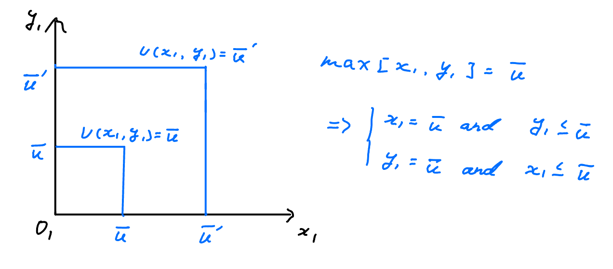
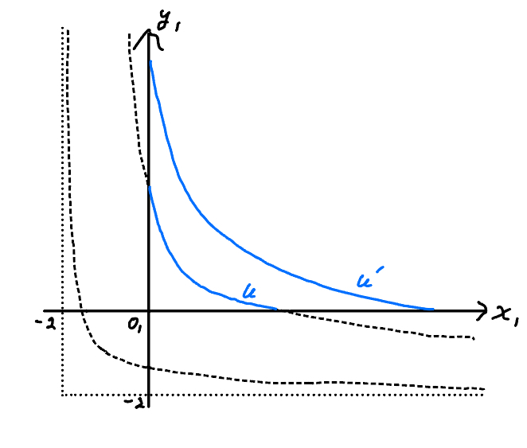
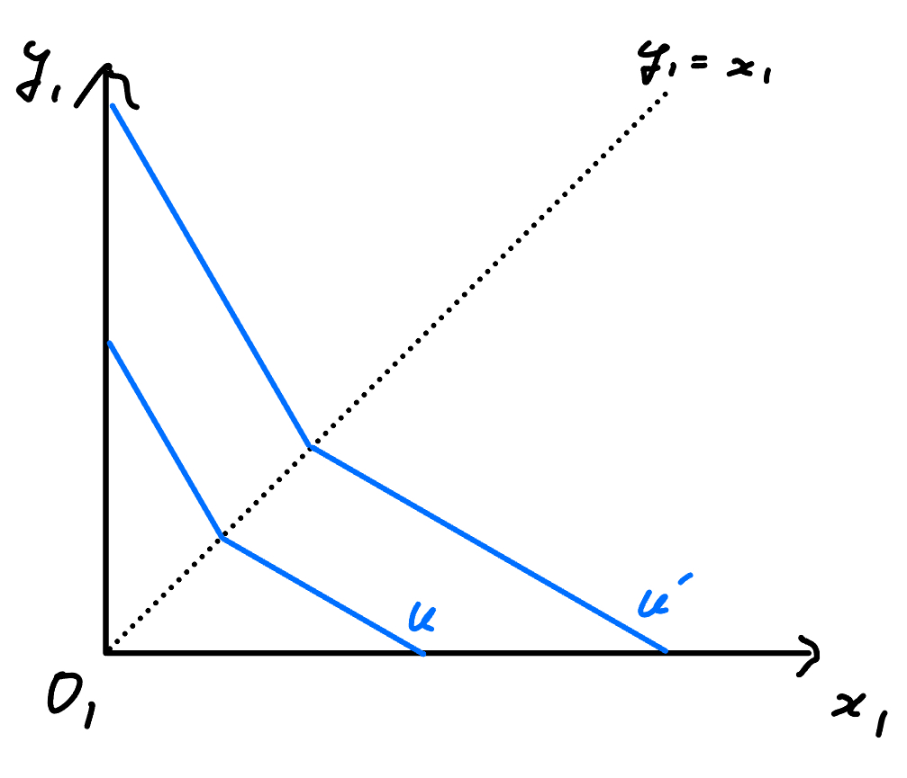
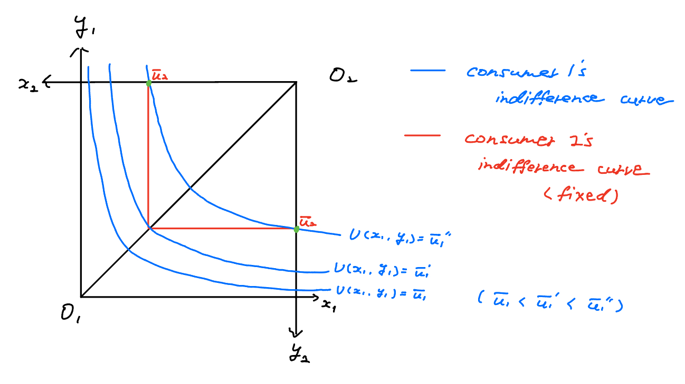
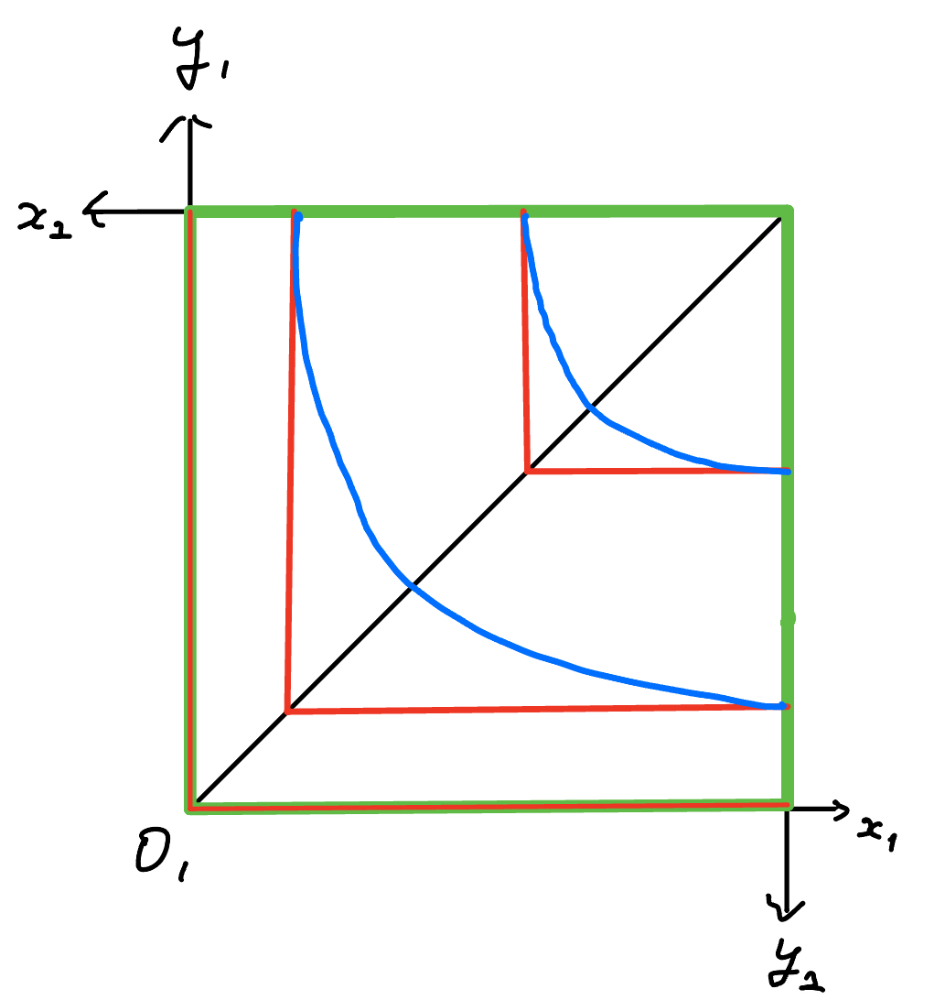

class: middle

```{r, child = '../setup.rmd', cache = FALSE}
```

```{r xaringan-scribble, echo=FALSE}
xaringanExtra::use_scribble()
```

```{r, include = F, cache = FALSE}
library(data.table)
library(ggplot2)
library(dplyr)
library(gganimate)
library(gifski)
library(gganimate)
# library(learnr)
```

```{r, include = F, eval=F, cache = FALSE}
httpgd::hgd()
httpgd::hgd_browse()
```

```{r xaringan-tachyons, echo=FALSE}
xaringanExtra::use_tachyons()
```


<!-- .content-box-green[**A Useful tip:**]

hitting letter "o" key will give you a panel view of the slides -->


# Reminder

The midterm is on <span style="color:blue">Apr 2nd (Tue)</span>. 

The topic is general equilibrium. 


???
+ Just a reminder, the midterm is on Apr 2nd, Tuesday. The topic is general equilibrium like you practiced with this week's assignment. 

+ This time, unlike Steve, Jay is relatively strict about exam time, so I recommend that you think about how to allocate your time. 


+ Again, you have options, if you understand the proof of Walras's law, 1st welfare theorem, and existence theorem under the assumption of strict convex preferences, then you can choose problems involving proof. Otherwise, I guess you need to solve four different GE problems. Some of them might be tricky. So, be prepared. 

 


---
class: middle

# Outline

+ Quick review of Assignment 1
+ Exercise problem 


---
class: middle

# Quick review of Assignment 1


"Show that the derived Walrasian equilibrium allocation is PO" (or maybe you could be asked "Show that the first welfare theorem holds for this economy")

<br>

For this type of question, you have several approaches:

**Approach 1**: plug $x^{\ast}$ into the contract curve and confirm that it returns $y^{\ast}$

**Approach 2**: Check $MRS_1=MRS_2$
+ Only valid for interior outcomes. For corner outcomes, this does not hold. 

**Approach 3**: If preferences are all LNS, then you can invoke the 1st welfare theorem. 

**Approach 4**: Argue that any movement away from the equilibrium makes someone worse off. 


???
+ Some questions in assignment 1 asked to check whether the derived Walrasian equilibrium is PO. I received some questions from some of you, so let me clarify this point. 


+ There are several approaches. 

---
class: middle

# Exercise problem

*Practice makes perfect*

???
+ I want to do lots of practice problems with you guys. Because, first of all, of course,  if you practice more, then you can learn lots of variations of general equilibrium problems, which in turn will be helpful for you to understand the concepts of 1st, 2nd welfare theorem, and the existence theorems.   

+ Second, some general equilibrium problems in the exam or prelim are tricky, if you haven't seen the similar problem, it might take more time. This is an especially big problem in the exam and prelim.   

+ I recommend you go through all the problems in the Jay's textbook. I did that last year. 
+ Maybe you don't have time to work on these problems but you should do them as least once before the prelim. Actually, most of the problems in this textbooks are from past prelim exams. So, you can expect a similar difficulty level of problems will be asked in the prelim. 

+ One thing that I wanted to mention is that even if you decided to commit to not doing the proofs, you still need to know about the theorem. For example, what is the strong form of the Walras's Law, and in what condition do they hold. 

+ For example, in what condition, we need to use 1st welfare theorem? What about 2nd welfare theorem? (First of all, preferences have to satisfy continuous, convex, and strictly monotone. Also, 2nd welfare theorem is only applicable to interior allocations.)


---
class: middle

# Various kinds of utility functions: 

.bg-washed-green.b--dark-green.ba.bw2.br3.shadow-2.ph2.mt2[
$$U(x_1, y_1) = max [x_1, y_1]$$
]

.bg-washed-green.b--dark-green.ba.bw2.br3.shadow-2.ph2.mt2[
+ 2018 June prelim:
$$U(x_1, y_1) = (x_1 + 2)(y_1 + 2)$$
]

.bg-washed-green.b--dark-green.ba.bw2.br3.shadow-2.ph2.mt2[
+ August 2014prelim and June 2021 prelim:
\begin{align*}
U(x_1, y_1) = 
    \begin{cases}
    x_1 + 2 y_1 \quad & \text{ if } \,x_1 \ge y_2 \\
    2 x_1 + y_1 \quad & \text{ if } \,x_1 \leq y_2 \\
  \end{cases}
\end{align*}
]


.content-box-green[**Questions**]

What do their indifference curves look like?

???
+ In the general equilibrium problems, the pattern is almost the same. The complication arises when the shape of the utility function becomes weird. 

+ Here, I listed some examples of tricky utility functions. 

---
class: middle

$$U(x_1, y_1) = max [x_1, y_1]$$

```{r  echo = F, out.width = "95%"}

```
???
+ 

---
class: middle

$$U(x_1, y_1) = (x_1 + 2)(y_1 + 2)$$

```{r  echo = F, out.width = "65%"}

```

---
class: middle

\begin{align*}
U(x_1, y_1) = 
    \begin{cases}
    x_1 + 2 y_1 \quad & \text{ if } \,x_1 \ge y_1 \\
    2 x_1 + y_1 \quad & \text{ if } \,x_1 \leq y_1 \\
  \end{cases}
\end{align*}


```{r  echo = F, out.width = "60%"}

```

---
class: middle

# Exercise problem

.bg-washed-green.b--dark-green.ba.bw2.br3.shadow-2.ph2.mt2[

Consider the following specific $2 \times 2$ competitive exchange economy, with consumers $j=1,2$ and goods $x$ and $y$. The consumers' preferences and initial endowments are given as follows:

+ Consumer 1: $U_1(x_1, y_1)=x_1y_1 \quad \text{and} \quad \omega_1=(12,4)$
+ Consumer 2: $U_2(x_2, y_2)=max[x_2, y_2]\quad \text{and} \quad\omega_2=(4,12)$

1. Find the set of Pareto-optimal allocations for this economy. You do not need to provide a mathematical derivation. Construct a carefully labeled Edgeworth-box diagram depicting the economy, including the endowment and at least one indifference curve for each consumer. Indicate the contract curve in your diagram.

2. True or False: This economy has a Walrasian equilibrium? If true, find the equilibrium price vector and allocation. If false, explain why the equilibrium does not exist. 
]

???
+ Here is the exercise problem I want to do today. 

---
class: top

# Memo:

---
class: top

# Memo:

---
class: middle
.bg-washed-green.b--dark-green.ba.bw2.br3.shadow-2.ph2.mt2[
+ Consumer 1: $U_1(x_1, y_1)=x_1y_1 \quad \text{and} \quad \omega_1=(12,4)$
+ Consumer 2: $U_2(x_2, y_2)=max[x_2, y_2]\quad \text{and} \quad\omega_2=(4,12)$
]

.content-box-green[**1. Find the set of PO allocations**]

The problem is formally written as,

\begin{aligned}
\max_{x_1,y_1} \quad & U_1(x_1, y_1)=x_1y_1 \\
\textrm{s.t.} \quad & max[x_2, y_2] = \overline{u_2} \quad (\text{where}, \overline{u_2} \text{ is some fixed level of utility})\\
  & x_1 + x_2 = 16 \\
  & y_1 + y_2 = 16
\end{aligned}

<br>

In other words, given the feasibility constraints and consumer 2's utility at some level, what is the set of bundles to maximize consumer 1's utility? 

<span style="color:blue">Visual inspection of the conditions of PO allocations with Edgeworth box is useful.</span>

<!-- .content-box-green[**Question**]

Explain the above explanation with words.

Given the feasibility constrains and a fixed level of indifference curve for consumer 2, 
+ Find the set of bundle of good 1 and good 2 that maximize consumer 1's utility 

&rarr; Find consumer 1's indifference curve of $x_1y_1$  -->

???
+ Okay the first question is to derive the set of PO allocations. 
+ For the first question, the problem can be mathematically written like this. We can solve this problem mathematically. 

+ But, this time, since we have a strong weapon called edgeworth box, which is a great graphical device to describe 2 by 2 exchange economy. So, let's solve this problem with the edgeworth box.

+ If we have differentiable utility functions, then it's easy. 
+ But sometime, we have utility function which is not differentiable. In that case, we can rely on have a strong weapon called edgeworth box, which is a great graphical device to describe 2 by 2 exchange economy. 


---
class: middle

+ Given consumer 2's indifference curve at some fixed utility level, move consumer 1's indifference curve to find consumer 1's utility maximizing bundles.

For example, 

```{r  echo = F, out.width = "65%"}

```

---
class: middle

The contract curve for this economy is the entire outline of the Edgeworth box (green line). 

```{r  echo = F, out.width = "60%"}

```

---
class: middle

.bg-washed-green.b--dark-green.ba.bw2.br3.shadow-2.ph2.mt2[
+ Consumer 1: $U_1(x_1, y_1)=x_1y_1 \quad \text{and} \quad \omega_1=(12,4)$
+ Consumer 2: $U_2(x_2, y_2)=max[x_2, y_2]\quad \text{and} \quad\omega_2=(4,12)$
]

<br>

.content-box-green[**2. Is there any Walrasian equilibrium for this economy?**]

<span style="color:blue">(i) Consumer 1's problem:</span>

\begin{aligned}
\max_{x_1, y_1} \quad & U_1(x_1, y_1)=x_1y_1 \\
\textrm{s.t.} \quad & p_x x_1 + p_y y_1 = 12 p_x + 4 p_y
\end{aligned}

<!-- For the optimal solution, it must be that  -->

<!-- $$MRS = - \frac{p_x}{p_y}$$ -->

<!-- The MRS of x for y is 
$$MRS = \frac{dy}{dx} = - \frac{\partial U_1 / \partial x_1}{\partial U_1 / \partial y_1} = - \frac{y_1}{x_1}$$
So, 
$$- \frac{y_1}{x_1} = $$
 -->

---
class: middle

<span style="color:blue">(ii) Consumer 2's problem </span>

\begin{aligned}
\max_{x_2, y_2} \quad & U_2(x_2, y_2)=max[x_2, y_2] \\
\textrm{s.t.} \quad & p_x x_2 + p_y y_2 = 4 p_x + 12 p_y
\end{aligned}


---
class: middle

# June 2022 Prelim 

Consider a $2 \times 2$ competitive exchange economy, where subscript $j = 1, 2$ indexes consumers and goods are $x$ and $y$. Preferences are represented by the utility functions $U_2(x_1, y_1)=x_1y_1$ and $U_2(x_2, y_2)=x_2+2y_2$. The initial endowment vectors are $\omega_1=(6,10)$ and $\omega_2=(6,0)$.

1. In an Edgeworth box diagram, indicate the endowment $\omega$ and draw indifference curves for each consumer. Also draw the contract curve, the set of Pareto-optimal allocations. Label your diagram carefully. 

2. Derive the demands $x_j(p, \omega_j)$ for the two consumers. Be sure to include demand behavior when prices are zero. 

3. Derive the Walrasian equilibrium price-allocation vector $(p^{\ast}, x^{\ast})$. Indicate and label the equilibrium, both $x^{\ast}$ and $p^{\ast}$, in your Edgeworth box from part (a).

4. Consider the PO allocation $x_1^{\prime}=(6,3)$ and $x_2^{\prime}=(6,7)$. Find a price vector, and also an alternative endowment vector $\omega^{\prime}$, that together will support this allocation as a Walrasian equilibrium. 


