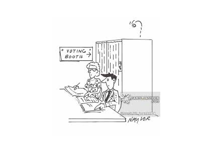

class: middle

```{r, child = '../setup.rmd', cache = FALSE}
```

```{r, include = F, cache = FALSE}
# here::i_am("GitControlled/Recitation/1_Introduction/recitation1_slides.rmd")
```

```{r xaringan-scribble, echo=FALSE}
xaringanExtra::use_scribble()
```

```{r xaringan-tachyons, echo=FALSE}
xaringanExtra::use_tachyons()
```

# Outline

+ Prepare for the final
+ Voting rule, medium voter theorem
+ Exercise problem

---

# header 1

## header 2

### header 3

---
class: middle

# For the final exam

+ We make a mistake. Most of the time because there is some gap (difference?) between what your knowledge and the true meaning. 
+ Fill in the gap! 
+ Specifically, ask yourself: <span style="color:blue">" <b>why I could not solve this problem? What am I missing?</b>"</span>
+ I think this is important thing in preparing for prelim. 

For example:

<b>Simple miscalculation?</b>

&rarr; No problem. Be careful next time!

<b>Forget something important concept?</b>

&rarr; Review it until you can convince yourself and can explain the concept with your own words. If possible, proof it (e.g., Walras' law, Arrow's theorem,...).


You took wrong approach to answer the question? 

<b>Think back on why you thought that your approach was correct. Find which part you misunderstood.</b>


 


---
class: middle

# Midterm Problem 2

Consumer 1: $U_1(x_1, y_1) = min\{x_1, y_1 \}$, $\omega_1 = \{6, 0\}$ 

Consumer 2: $U_2(x_2, y_2) = min\{x_2, y_2 \}$, $\omega_2 = \{0, 4\}$ 

.content-box-green[**Question**]

1. Identify the set of PO allocations.

2. *True or False*: There is an equilibrium for the economy with $p^{x}>0$ and $p^{y}>0$.

---
class: middle

# One of my favorite problems (Try this later)

1. Consider the following $2\times 2$ competitive exchange economy, with 
consumers $j=1,2$ and goods $x$ and $y$. The consumers' preferences are given 
by:
$$
U_1(x_1,y_1 )= \ln x_1  + 2\ln y_1 
U_2(x_2,y_2 )= \min \{2\ln x_2,\ln y_2\} .
$$

Endowments are $\omega_1 = (3/4,1/4)$ and $\omega_2 = (1/4,3/4)$. 

a. Derive the contract curve for this economy. Construct a carefully 
labeled Edgeworth-box diagram depicting the economy, including the endowment, 
an indifference curve for each consumer, and the contract curve. 

b. Derive the two consumers' offer curves (demands). Find a Walrasian 
equilibrium for the economy. Show that the equilibrium allocation is also Pareto 
optimal. Add the equilibrium allocation and equilibrium price line to your 
diagram.

---

# Voting

.bg-washed-green.b--dark-green.ba.bw2.br3.shadow-2.ph2.mt2[

**Condorcet's paradox**

There is no social welfare function exists under majority rule. Majority rule behaves in a way that is self-contradictory (violation of transitivity). 
]


This is exactly what Arrow's impossibility theorem is telling. 

<br>

.bg-washed-green.b--dark-green.ba.bw2.br3.shadow-2.ph2.mt2[

**Arrow's impossibility theorem**

Suppose that preferences $P_j$$ are transitive, and the #|X| \ge 3$. Then, any social welfare function satisfying (i)Unrestricted domain, (ii) Pareto principle, and (iii) independent of irrelevant alternatives is dictatorial. 

]

<br>

<!-- <span style="color:blue">There is no way to aggregate any profiles of individual profiles  ($\{P_j\}_{j=1}^{n}$) into a coherent social preference order that satisfying  </span> -->


+ However, under some assumption (restriction) about people's preferences, it yields a unique outcome (i.e., Condorcet winner)


---
class: middle

# The medium voter theorem

```{r, out.width = "70%", echo=F}

```


---
class: middle

.bg-washed-green.b--dark-green.ba.bw2.br3.shadow-2.ph2.mt2[

**The medium voter theorem**

Suppose that the number of the voters is odd and that <span style="color:blue">each voter's preferences are single peaked</span>. For any single-peaked profile, there is a unique Condorcet winner, and it is the median of the $x^{\ast}_j$. 
]

<br>

.content-box-green[**Question**]

+ Which of the axiom of Arrow's theorem does the single-peaked preference assumption violate?

???
+ Arrow's four axiom
+ unrestricted domain of social welfare function
+ dictatorial 
+ Pareto principle
+ IIA (independent of irrelevant alternatives)


---
# Exercise Problem: Prelim 2018 Question IV.2 (partial)

Consider an economy with one pure public good y and one private good $x$ and consumers $j = 1, 2, ..., J$. Assume throughout that $J$ is an odd number. Consumer $j$'s utility function is  $\color{blue}{U_j(x_j, y) = x_j + \theta_j log y}$, with $\theta_j \in (0,1]$. Each consumer has an initial endowment of the private good of $\omega_j=1$. THe public good is produced according to $y=\sum_j z_j$, where $z_j$ is consumer $j$'s contribution of the private good to the provision of $y$. 

(a) Find the level of the public good for interior PO allocations.

(b) Suppose political constraints require that the public good be financed by a poll tax of $t$ on each consumer, so that $y(t)=Jt$ and $j$'s consumption of the private good is $1-t$. Express $U_j$ as a function only of $t$ and show that $U_j$ is single peaked in $t$. Find the optimal level of $t$ for consumer $j$.

(c) Take the vector $\mathbf{\theta}=(\theta_1, ..., \theta_J)$ as given and suppose the level of the common tax is chosen by a majority vote among consumers. Determine the winning level $t^{\ast}$ of the tax. Provide a proof of the claim that $t^{\ast}$ will be selected by majority rule. Be sure to include a clear statement of any conditions
required for your proof. 


---
class: top

# MEMO

---
class: top

# MEMO

---

class: middle


Please practice social choice problems with past exams. 


---
class: middle

Thank you!!!


